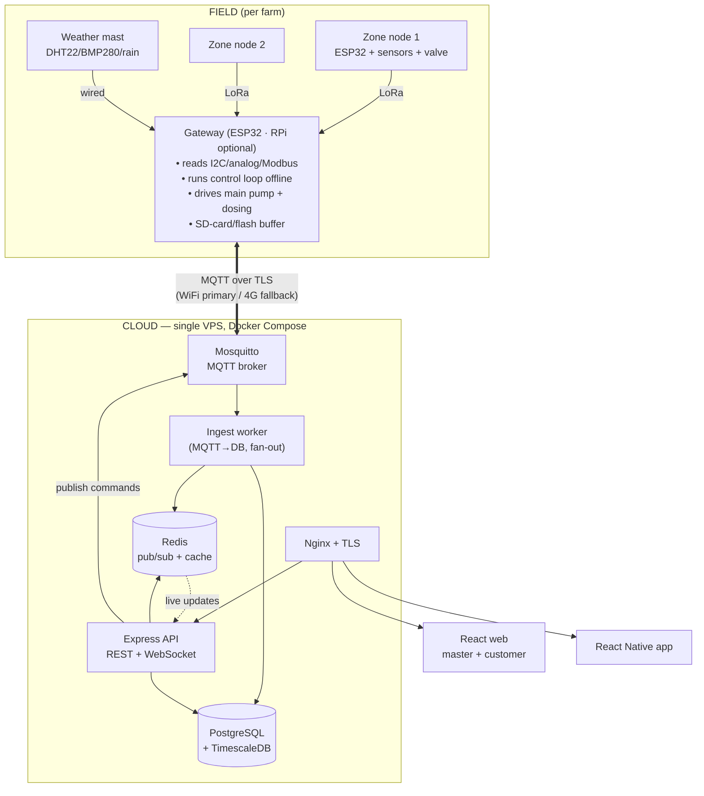
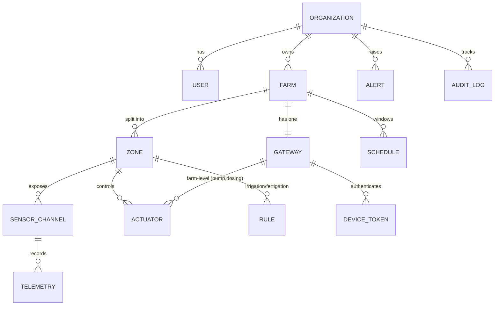

# 01 · System Architecture

> The master technical overview for TERANODE. Read this before `02` (IoT) and `03` (Web/App).
> Related: [README](./README.md) · [IoT & Firmware](./02-IoT-Hardware-and-Firmware.md) · [Web & App](./03-Web-and-Mobile-App.md)

---

## 1. Goals & non-goals

**Goals**
- One **gateway "brain" per farm** that runs irrigation/fertigation **locally and offline**, and syncs to the cloud.
- **Zoned** sensing & actuation — each zone has its own moisture/NPK/pH and its own valve.
- **Multi-tenant cloud from day one**: company super-admins provision customers; each customer manages only their own farm(s).
- Real-time monitoring + control from web and mobile; alerts when something needs attention.
- Field reliability: keep watering correctly even if the internet, cloud, or power blips.

**Non-goals (for the MVP)**
- Automated e-commerce/payments (manual provisioning instead; hook documented for later).
- ET/ML-based predictive irrigation (Phase 3).
- Per-zone independent fertilizer recipes (MVP uses **central** dosing at the manifold; per-zone dosing is future).

---

## 2. Tenancy model

```
Platform (TERANODE company)
└── Organization (a customer / tenant)        ← data isolation boundary
    └── Farm (a physical site)                ← exactly one Gateway
        └── Zone (a soil-uniform patch)       ← sensors + one valve
            ├── SensorChannels (moisture, pH, NPK, soil-temp…)
            └── Actuator (zone valve)
        └── Farm-level actuators: main pump, dosing pump(s)
        └── Farm-level weather mast: air temp/humidity, pressure, rain
```

**Who sees what**

| Role | Scope | Can do |
|---|---|---|
| **Super-admin** (company) | All organizations | Create/disable orgs & users, bind gateways/devices to orgs, view fleet health, push firmware, impersonate for support |
| **Org-admin** (customer owner) | Own organization | Design farms/zones, manage org users, set rules/thresholds, manual override pumps/valves, billing later |
| **Operator** (customer staff) | Own organization | Monitor, acknowledge alerts, manual override (if permitted) |
| **Viewer** | Own organization | Read-only dashboards |

Data isolation: every tenant-owned row carries an `organization_id`; all API queries are scoped by the caller's `organization_id` (enforced in middleware, optionally hardened with PostgreSQL Row-Level Security). Super-admin endpoints are a separate, audited surface.

---

## 3. End-to-end architecture



<details><summary>ASCII fallback</summary>

```
FIELD (per farm):
  Zone nodes (ESP32: sensors + valve) --LoRa--> Gateway (ESP32; RPi optional)
  Weather mast (DHT22/BMP280/rain)    --wired--> Gateway
  Gateway: control loop (offline-capable) + main pump + dosing pumps + SD-card/flash buffer

   <== MQTT/TLS over WiFi (primary) or 4G (fallback) ==>

CLOUD (one VPS, Docker Compose):
  Mosquitto (MQTT) -> Ingest worker -> PostgreSQL+TimescaleDB
                                    -> Redis (pub/sub, cache)
  Express API (REST + WebSocket) <-> Postgres / Redis ; publishes commands to Mosquitto
  Nginx (TLS) fronts the API + static web

CLIENTS:
  React web (company master dashboard + customer admin panel)
  React Native app (customers)
```
</details>

### Layers

1. **Sensing/actuation (zone nodes + weather mast)** — cheap MCUs read soil/weather and switch that zone's valve. Details in `02`.
2. **Edge gateway (ESP32)** — the per-farm brain. Aggregates node data, evaluates rules, drives the **main pump** and **dosing pumps**, buffers to an **SD card / flash**, and bridges to the cloud over MQTT. **Runs the irrigation loop even with no internet.** A **Raspberry Pi 4 is an optional upgrade** when a farm needs heavy edge processing, an on-site touchscreen, or local analytics — it exposes the same MQTT contract, so nothing else changes.
3. **Transport (MQTT)** — Mosquitto broker; TLS + per-device ACL. Telemetry up, commands down, retained "desired state."
4. **Cloud services** — ingest worker, Express API (REST + WebSocket), PostgreSQL + TimescaleDB (time-series), Redis (live fan-out + cache). All Dockerized on one VPS behind Nginx.
5. **Clients** — React web (two surfaces) + React Native app. Details in `03`.

---

## 4. Telemetry & command flow (MQTT)

**Why MQTT:** lightweight, survives intermittent links, supports retained state + Last-Will (offline detection), and clean pub/sub for commands. (HTTP/WebSocket are used client↔cloud; MQTT is gateway↔cloud.)

### Topic scheme

```
teranode/{orgId}/{farmId}/{gatewayId}/...
  telemetry/zone/{zoneId}          ← gateway → cloud   (QoS 1)  batched zone readings
  telemetry/weather                ← gateway → cloud   (QoS 1)
  telemetry/gateway/health         ← gateway → cloud   (QoS 1)  cpu temp, battery, link, fw ver
  state/zone/{zoneId}              ← gateway → cloud   (retained) valve open?, pump on?, mode
  cmd/zone/{zoneId}                ← cloud → gateway   (QoS 1)  open/close valve, set thresholds
  cmd/farm/pump                    ← cloud → gateway   (QoS 1)  pump on/off, dosing dose
  cmd/gateway/config               ← cloud → gateway   (QoS 1, retained) rules/schedule push
  lwt/gateway                      ← broker-set        (retained) "online"/"offline"
```

- **Telemetry** is published QoS 1 (at-least-once); the ingest worker dedupes by `(gatewayId, ts, channel)`.
- **Commands** are QoS 1; the gateway ACKs by republishing the resulting `state/...` (retained), so the UI reflects *actual* device state, not just the request. This is the **desired-vs-reported state** pattern — the cloud never assumes a command took effect until the device reports back.
- **LWT** (Last Will & Testament) marks a gateway offline within seconds of a dropped connection; drives the "device offline" alert.
- **Security:** each gateway authenticates with a unique device token (username/password or client cert) and an **ACL** that restricts it to its own `teranode/{orgId}/{farmId}/{gatewayId}/#` subtree — a compromised device can't read or write another tenant's topics.

### Offline behavior
- Gateway keeps running the control loop from its last-known config.
- Telemetry is written to a **local ring buffer (SD card / flash)**; on reconnect it back-fills the cloud (ordered, deduped).
- Commands issued while offline are delivered when the gateway reconnects (broker queues QoS 1 for the subscribed session; the gateway also re-reads the retained `cmd/gateway/config`).

---

## 5. Core data model

Relational core in PostgreSQL; high-volume readings in a TimescaleDB **hypertable**.



**Key tables**

| Table | Purpose | Notable columns |
|---|---|---|
| `organizations` | Tenant boundary | `id`, `name`, `status`, `plan` |
| `users` | Login + role | `id`, `org_id`, `email`, `role`, `password_hash` |
| `farms` | Physical site | `id`, `org_id`, `name`, `geo`, `timezone` |
| `gateways` | The brain | `id`, `farm_id`, `serial`, `fw_version`, `last_seen`, `status` |
| `zones` | Soil-uniform patch | `id`, `farm_id`, `name`, `area_m2`, `crop`, `polygon` |
| `devices` (nodes) | Zone nodes | `id`, `zone_id`, `gateway_id`, `radio_addr`, `battery`, `last_seen` |
| `sensor_channels` | A measurable signal | `id`, `zone_id`/`farm_id`, `type` (moisture/ph/n/p/k/ec/soiltemp/airtemp/humidity/pressure/rain), `unit`, `calibration` (jsonb) |
| `telemetry` *(hypertable)* | Time-series readings | `time`, `channel_id`, `value`, `quality` |
| `actuators` | Valve/pump/dosing | `id`, `scope` (zone/farm), `type`, `state`, `mode` (auto/manual) |
| `rules` | Per-zone control | `id`, `zone_id`, `moisture_low`, `moisture_high`, `rain_skip_mm`, `ec_target`, `ph_target` |
| `schedules` | Allowed watering windows | `id`, `farm_id`, `cron`/window, `enabled` |
| `dosing_profiles` | Fertigation recipe | `id`, `farm_id`, `ec_target`, `ph_target`, `pumps[]` |
| `alerts` | Events needing attention | `id`, `org_id`, `severity`, `type`, `source`, `acknowledged_at` |
| `audit_log` | Who did what | `id`, `org_id`, `actor`, `action`, `target`, `ts` |
| `device_tokens` | Gateway identity | `id`, `gateway_id`, `secret_hash`, `revoked` |

**Retention & rollups (TimescaleDB):** raw telemetry kept ~90 days; **continuous aggregates** produce 5-min / hourly / daily rollups for fast charts; compression on chunks older than 7 days. The app reads rollups for long ranges and raw for the live view.

---

## 6. Control logic placement (edge-first)

The irrigation/fertigation decision lives on the **gateway**, not the cloud, so a farm keeps watering correctly through outages. The cloud is the **source of truth for configuration** (rules, schedules, dosing profiles) and the **system of record for history**; it pushes config via retained `cmd/gateway/config` and the gateway caches it locally. Manual overrides from the app are commands that temporarily supersede auto mode and are always reflected back via `state/...`. Algorithm specifics live in `02 §6`.

---

## 7. Security overview

| Surface | Control |
|---|---|
| Gateway ↔ broker | TLS; unique device token; ACL locked to its own topic subtree; revocable on theft |
| Client ↔ cloud | HTTPS only; JWT access token (short-lived) + refresh token; CORS allow-list |
| Authorization | Multi-tenant RBAC; every query scoped by `organization_id`; super-admin surface separated + audited |
| Secrets | `.env` on the VPS (not in git); per-environment; rotate device tokens & JWT signing keys |
| Data isolation | App-layer org scoping (MVP) → optional Postgres Row-Level Security (hardening) |
| Transport hardening | Nginx TLS (Let's Encrypt), HSTS, rate limiting on auth + command endpoints |
| Auditing | `audit_log` for every privileged/control action; alerts on anomalies |

---

## 8. Environments & deployment topology

- **dev** — Docker Compose on a developer machine; a "virtual gateway" script publishes fake telemetry so the app can be built without hardware.
- **staging** — small VPS mirroring prod; one real gateway pointed at it for integration tests.
- **prod** — VPS (DigitalOcean/Hetzner) running Docker Compose: `nginx`, `api`, `ingest-worker`, `mosquitto`, `postgres` (+ TimescaleDB), `redis`. Nightly off-host DB backups; volume snapshots.

```
VPS (Ubuntu LTS + Docker)
└── docker-compose.yml
    ├── nginx        (443, TLS, reverse proxy + static web)
    ├── api          (Express REST + WebSocket)
    ├── ingest       (MQTT subscriber → Postgres/Redis)
    ├── mosquitto    (8883 MQTTS, 1883 internal)
    ├── postgres     (TimescaleDB image)
    └── redis
```

A scaling path to AWS (IoT Core + ECS + RDS) is noted in `04 §Phase 3` but is intentionally out of MVP scope.

---

## 9. Key cross-cutting decisions (and why)

| Decision | Why |
|---|---|
| Edge-first control | Crops can't wait for the cloud; outages must not stop watering |
| MQTT for device link | Built for unreliable links; retained state + LWT; cheap on cellular |
| Postgres + TimescaleDB (not a separate TSDB) | One database to operate; relational + time-series together; fits the chosen Postgres stack |
| Multi-tenant from day one | Explicit product requirement (master dashboard provisions customers) |
| Per-device ACL + token | A stolen field device must not expose other tenants |
| Manual provisioning (MVP) | Avoids building payments now; provisioning model still supports automation later |

---

## 10. Open items to confirm during build
- Central vs per-zone dosing (MVP assumes **central**; revisit if crops need different recipes per zone).
- Zone-node radio: LoRa default — confirm field distances at the pilot site (`02 §4`).
- RLS now vs later (MVP can ship with app-layer scoping; add RLS before onboarding many tenants).
