# 🌱 TERANODE — Project Overview & Architecture (Visual)

> A single compiled picture of the whole product: the idea, the system, the data, the
> flows, and how it runs. Diagrams are [Mermaid](https://mermaid.js.org) — they render on
> GitHub, in VS Code (with a Mermaid extension), and in most Markdown viewers.
> Companion docs: [01-System-Architecture](./01-System-Architecture.md) ·
> [02-IoT-Hardware-and-Firmware](./02-IoT-Hardware-and-Firmware.md) ·
> [BUILD-SPEC](./BUILD-SPEC.md) (as-built spec) · [../RUN.md](../RUN.md) (how to run).

---

## 1. The idea

**The problem.** Smallholder vegetable farmers water and feed by habit and guesswork.
Over‑/under‑watering wastes water and power, leaches nutrients, and costs yield. Soil
moisture, pH, EC and N‑P‑K vary by zone and shift as a crop grows — but nobody can watch
all of that by hand, and the internet/power at a farm is unreliable.

**The product.** TERANODE is a **crop‑driven smart irrigation + fertigation system**. A
field "brain" (an **ESP32 gateway**) reads per‑zone soil sensors and a weather mast, and
drives a pump + per‑zone valves + nutrient dosing — **running the irrigation logic locally
even with no internet**, and syncing to the cloud when it can. The farmer **picks the crop
for each zone**; the system then knows that crop's ideal ranges for every growth stage and
**auto‑tunes the watering/feeding targets**, scores each zone's health 0–100, and tells the
farmer in plain language (English/Nepali) what to do next.

**Who uses it.**
- **Admin** (the company) — a **web console**: creates customer accounts, registers + binds
  ESP32 gateways, watches the whole fleet, pushes firmware (OTA), edits the crop library and
  per‑customer device entitlements, and reviews an audit trail.
- **Customer / farmer** — a **mobile app**: a live, crop‑aware dashboard of their field,
  per‑zone health + coaching, a guided "assign a crop + its sensors" flow, manual valve
  override, analytics & water/fertilizer savings, harvest log, and alerts.

**Why it's different:** edge‑first (crops can't wait for the cloud), **crop‑aware agronomy**
(not just generic thresholds), modular hardware (turn device classes on/off per customer),
and fully **simulation‑driven** so the whole thing is demoable without a single sensor.

---

## 2. System context


The cloud is the **source of truth for configuration** (crops, rules, schedules, dosing) and
the **system of record for history**; the gateway is the **real‑time controller** at the edge.

---

## 3. End‑to‑end architecture


**Edge‑first control:** the irrigation/fertigation decision lives on the gateway, so the farm
keeps watering correctly through cloud/internet/power blips; telemetry is buffered and
back‑filled on reconnect. The **virtual gateway** in `@teranode/ingest` replays the same
control logic over MQTT, so the entire cloud lights up with **no hardware**.

---

## 4. Monorepo & module map


The shared packages are the **single source of truth**: the same `analyzeZone` agronomy
engine runs in the API, the ingest worker, the web admin, and the mobile mock — so a zone's
health score and recommendations are identical everywhere.

---

## 5. Roles & tenancy (2‑role model)


- **Tenant boundary = the customer account.** Every tenant‑owned row carries `account_id`.
- **Admin** sees/does everything (create customers, bind gateways, fleet, OTA, edit any
  customer's entitlements — no create‑time lock). **Customer** is scoped to its own account.
- Enforced in middleware: `requireAuth` → `requireAdmin` / `scopeToCustomer`. JWT carries
  `userId, accountId, accountType, role`.

---

## 6. Data model (entity‑relationship)


High‑volume readings (`TELEMETRY`, `USAGE_EVENTS`) are **TimescaleDB hypertables** with
**continuous aggregates** `telemetry_5m / 1h / 1d` and `usage_1d` for fast charts, plus 90‑day
retention + compression. `DEVICE_CATALOG` (not shown) is the data‑driven module list that
`ENTITLEMENT_RECORDS.values` references.

---

## 7. Crop library & growth stages

14 vegetables ship in `@teranode/agronomy` (data‑driven — adding a crop is one file):

| 🍅 tomato | 🫑 capsicum | 🌶️ chili | 🥒 cucumber | 🥬 spinach | 🥗 lettuce | 🥬 cabbage |
|---|---|---|---|---|---|---|
| 🥦 **cauliflower** | 🧅 **onion** | 🥕 **carrot** | 🥔 **potato** | 🍆 **eggplant** | 🌿 **okra** | 🫘 **beans** |

Each crop carries English + Nepali names, category, days‑to‑harvest, and a **stage timeline**
where the ideal/acceptable bands (moisture, pH, EC, N, P, K, soil‑temp, air‑temp) shift over
time:


The current stage is **derived from `planting_date`**, so the targets a zone is held to move
automatically as the crop matures.

---

## 8. Agronomy engine pipeline


Pure, deterministic, and unit‑tested (**72 tests**). Example output: *"N is 80 mg/kg vs
120–150 target for the fruiting stage — increase nutrient dosing."* Picking a crop for a zone
runs `deriveRule()` and writes the zone's control thresholds automatically.

---

## 9. Key flows (sequences)

### 9.1 Auth (JWT access + rotating refresh)

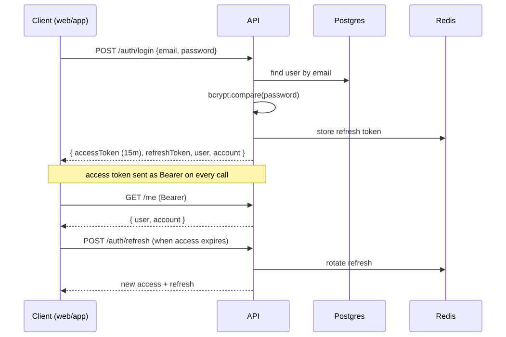

### 9.2 Admin onboards a customer + binds a gateway

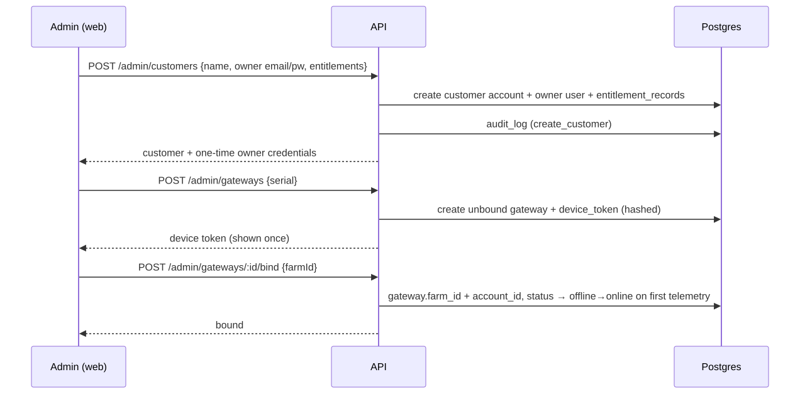

### 9.3 Farmer assigns a crop + sensors to a zone

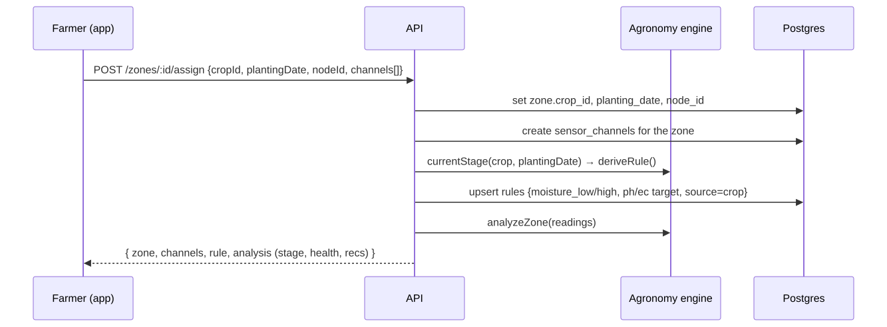

### 9.4 Live telemetry round‑trip (hardware‑free)

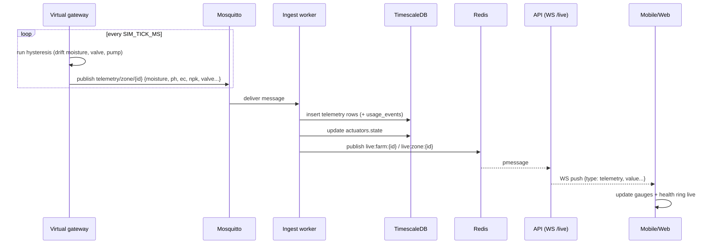

### 9.5 Actuator command (desired‑vs‑reported)

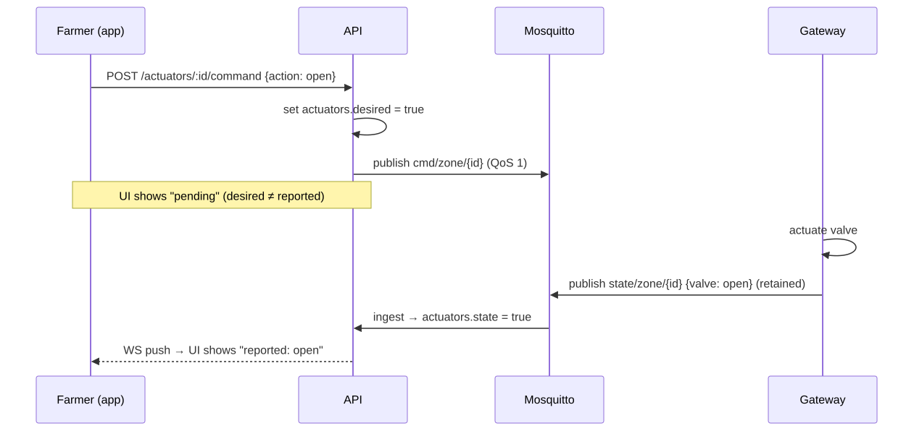

---

## 10. Edge control loop (per zone, per cycle)


The same hysteresis runs on the ESP32 firmware, in the virtual gateway, and in the mobile
mock — one behavior, three places.

### Valve state (auto mode)


---

## 11. MQTT topic scheme

```text
teranode/{accountId}/{farmId}/{gatewayId}/...
  telemetry/zone/{zoneId}      gateway → cloud   batched zone readings
  telemetry/weather            gateway → cloud   air temp/humidity/pressure/rain
  telemetry/gateway/health     gateway → cloud   liveness heartbeat
  state/zone/{zoneId}          gateway → cloud   retained: valve/pump/mode (reported)
  cmd/zone/{zoneId}            cloud → gateway   open/close, set thresholds
  cmd/gateway/config           cloud → gateway   retained: rules/schedule/dosing push
```

Telemetry up (QoS 1, deduped), commands down (QoS 1), retained **desired/reported state**, and
Last‑Will marks a gateway offline within seconds → drives the offline alert. Each device is
ACL‑scoped to its own subtree.

---

## 12. API surface (2‑role)


---

## 13. Deployment topology


> On this build machine the host already runs Postgres/Redis, so containers are mapped to
> **5433 / 6380** (see `.env` + `RUN.md`).

---

## 14. User journeys

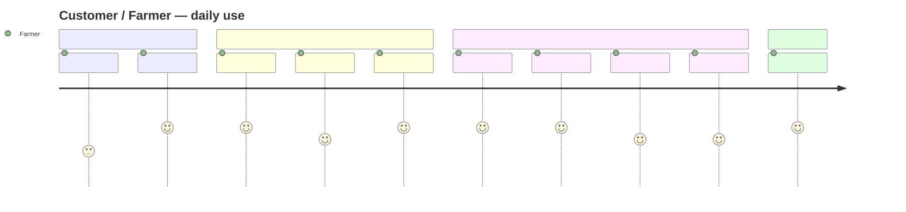

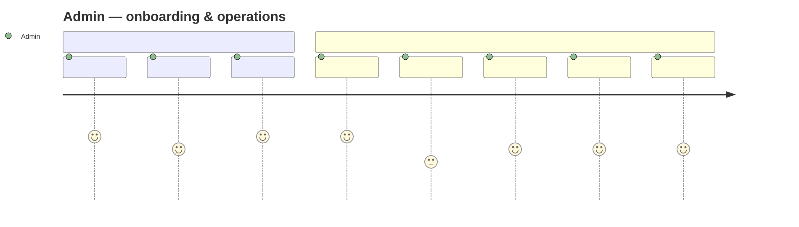

---

## 15. How it was built (and verified)


| Layer | Verified |
|---|---|
| Agronomy engine | 72/72 unit tests pass |
| Database | migrate (hypertables + CAGGs) + seed (14 crops, demo tenant) |
| Auth & RBAC | both roles login; customer→admin = 403 |
| REST | all route groups return 200 for the right role |
| Realtime | virtual gateway → ingest → Timescale → Redis → **WS push received**; zone health 0 → 85 on live data |
| Web admin | `vite build` clean; talks to live API |
| Mobile app | typecheck clean; Metro bundle builds; runs on simulation mock |

---

### Legend / conventions
- **Health score** 0–100 per zone; ≥80 green, 50–79 amber, <50 red.
- **Channels:** moisture %, pH, EC mS/cm, N/P/K mg/kg, soil/air temp °C, humidity %, rain mm.
- **Demo logins:** `admin@teranode.io` (web) · `farmer@greenvalley.np` (app) — password `teranode`.

*Generated as the compiled architecture overview. To render to PNG/SVG, use the Mermaid CLI or paste any block into mermaid.live.*
